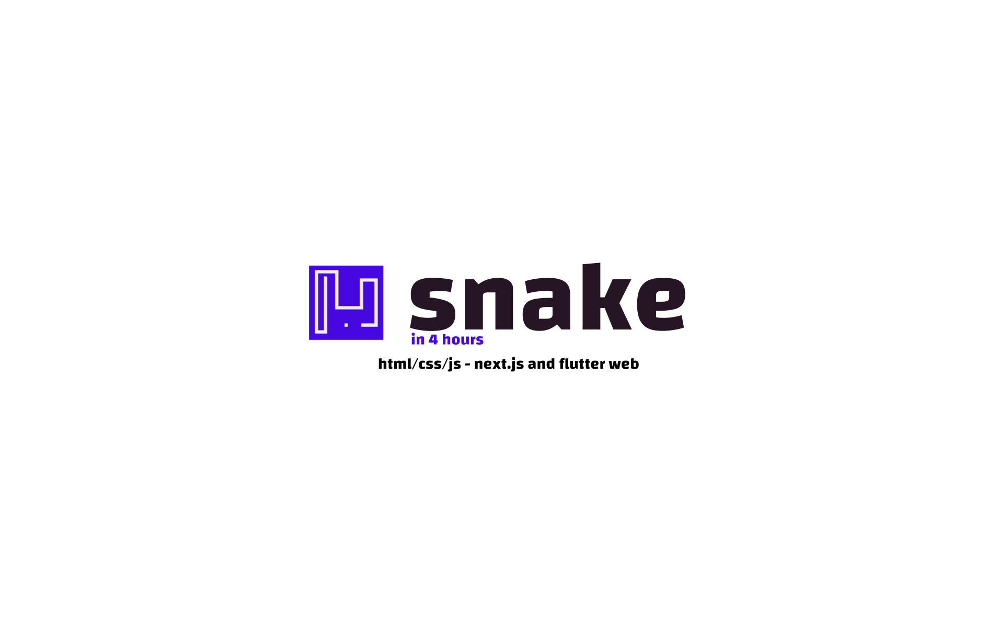

# 🐍 Snake Multi-Platform Showcase

This project aims to showcase the classic Snake game implemented on three different platforms: HTML/JavaScript, Flutter for the web, and Next.js. The challenge was to complete the project within 24 hours, utilizing various tools, including Coolify for hosting, ChatGPT for code assistance, and Umami for analytics.

## Table of Contents

- [🐍 Snake Multi-Platform Showcase](#-snake-multi-platform-showcase)
  - [Table of Contents](#table-of-contents)
  - [Introduction](#introduction)
  - [Platforms](#platforms)
    - [1. HTML/JavaScript 🌐](#1-htmljavascript-)
    - [2. Flutter for the Web 🚀](#2-flutter-for-the-web-)
    - [3. Next.js 🌐](#3-nextjs-)
  - [Installation](#installation)
  - [Usage](#usage)
  - [Project Structure](#project-structure)
  - [Acknowledgments](#acknowledgments)

## Introduction

The goal of this project was to create a showcase of the classic Snake game implemented on three different platforms: HTML/JavaScript, Flutter for the web, and Next.js. The challenge was to complete the entire project within 4 hours, by working on the project a few minutes per day, while incorporating various modern tools and frameworks.

## Platforms

### 1. HTML/JavaScript 🌐

The HTML/JavaScript version of the Snake game is a classic implementation using the canvas element. It features a simple user interface with buttons for directional controls, allowing users to play the game in a web browser.

### 2. Flutter for the Web 🚀

The Flutter for the web version utilizes the Flutter framework to create a "cross-platform" Snake game experience. The game supports touch gestures for mobile devices and keyboard controls for desktop users, providing a seamless and interactive gaming experience.

### 3. Next.js 🌐

The Next.js version integrates all three Snake game implementations into a single web application. Users can choose between the HTML/JavaScript, Flutter for the web, and Next.js versions through a menu. This demonstrates the versatility of Next.js for hosting multiple web-based projects.

## Installation

To run each version of the Snake game locally, follow the installation instructions provided in the respective directories:

- [HTML/JavaScript](/html-snake)
- [Flutter for the Web](/flutter_snake)
- [Next.js](/nextjs-snake)

## Usage

1. Choose the platform you want to explore from the menu in the Next.js web application.
2. Follow the installation instructions for the selected platform.
3. Run the respective project locally.
4. Play the Snake game and enjoy the classic gaming experience.

## Project Structure

- **/html-snake:** Contains the HTML/JavaScript version of the Snake game.
- **/flutter_snake:** Contains the Flutter for the web version of the Snake game.
- **/nextjs-snake:** Contains the Next.js web application that integrates all three versions of the Snake game.

## Acknowledgments

- **Coolify:** Used for hosting.
- **ChatGPT:** Assisted in generating code snippets and providing guidance during the development process.
- **Umami:** Integrated for analytics, allowing for insights into user engagement and behavior.

Feel free to explore, play the Snake game, and enjoy the showcase of multi-platform development within a X-hour timeframe! If you encounter any issues or have suggestions for improvement, please open an issue or submit a pull request.

🎮 **Play the Snake Game Live:** [https://snake.mohamis.me/](https://snake.mohamis.me/)

---
