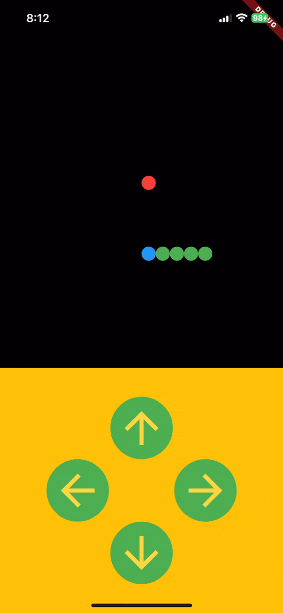

# flutter_snake



Welcome to **flutter_snake**, a Flutter project that brings the classic Snake game to life on iOS and Android!

## Getting Started

The Flutter version utilizes the Flutter framework to create a "cross-platform" Snake game experience. The game supports touch gestures for mobile devices, providing a simple and interactive gaming experience.

### Prerequisites

Before running the project, make sure you have Flutter installed on your machine. If not, you can follow the official Flutter installation guide [here](https://flutter.dev/docs/get-started/install).

### Installation

1. Clone the repository:

   ```bash
   git clone https://github.com/mohamis/snake.git
   ```

2. Navigate to the project directory:

   ```bash
   cd flutter_snake
   ```

3. Install dependencies:

   ```bash
   flutter pub get
   ```

### Run the App

Run the following command to start the development server:

```bash
flutter run -d ios or android
```

This will launch the Snake game on your local device or simulator.

## Gameplay

- Control the snake using the buttons on mobile devices.
- Navigate the snake to eat the red food and grow longer.
- Avoid colliding with the snake's own body.
- The head is blue.
- The snake will not move at first.

## Project Structure

- **lib/main.dart:** Entry point for the Flutter application.
- **lib/not_available.dart:** Widget for unsupported platforms.

## Acknowledgments

- **Flutter:** The project utilizes the Flutter framework for cross-platform development.
- **Dart:** The programming language used for building Flutter applications.

Feel free to explore, play the Snake game, and enjoy the classic gaming experience brought to you by Flutter!
