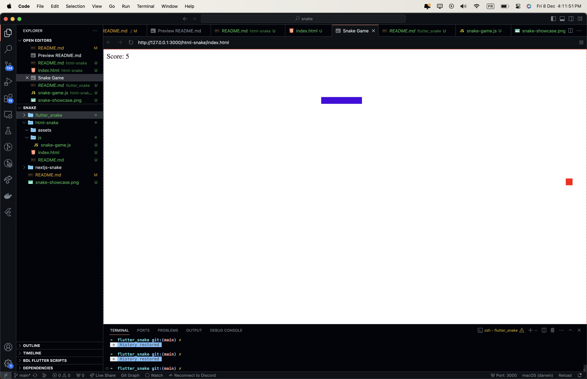

# html-snake

Welcome to **html-snake**, a classic implementation of the Snake game using HTML and JavaScript.

## Getting Started

This project is a simple HTML/JavaScript implementation of the Snake game that you can play directly in your web browser.

### Gameplay

- Open the `index.html` file in your web browser.
- Control the snake using the arrow buttons for directional controls.
- Navigate the snake to eat the red food and grow longer.
- Avoid colliding with the walls or the snake's own body.
- Challenge yourself to achieve the highest score!

## Project Structure

- **index.html:** The main HTML file for the Snake game.
- **assets/snake_html.png:** Image preview for the README.

## Acknowledgments

- **HTML/JavaScript:** The project utilizes classic web technologies for simple and accessible gameplay.

Feel free to explore, play the Snake game, and enjoy the classic gaming experience !
